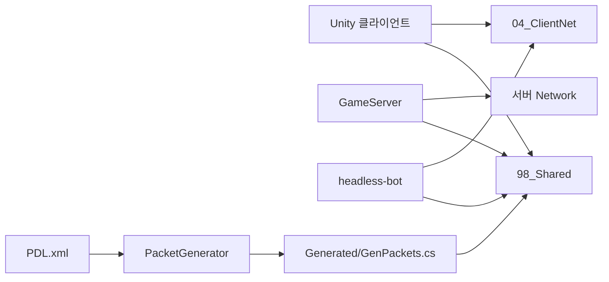

# 시스템 구조

현재 구현의 구조를 설명한다. 제품 범위는 [PRD](PRD.md), 기능별 수정 위치는 [FEATURE_MAP](FEATURE_MAP.md), 작업 권한은 [AGENTS](../AGENTS.md)를 따른다.

## 구성과 의존성

| 구성 | 역할과 경계 | 구현 근거 |
|---|---|---|
| 서버 | 권위 상태, 판정, 맵·파티·퀘스트 진행 | [GameWorld](../02_Server/GameServer/Loop/GameWorld.cs), [GameMap](../02_Server/GameServer/Maps/GameMap.cs) |
| 서버 전송 계층 | 연결·송수신·프레임 분리; 게임 규칙은 GameServer에 둠 | [Network](../02_Server/Network/) |
| 클라이언트 | 입력, 예측·재조정, 보간, 화면·음향 | [Scripts](../03_Client/Assets/Scripts/) |
| 클라이언트 전송 계층 | Unity API 없는 .NET Standard 2.1 라이브러리; 봇도 사용 | [ClientNet](../04_ClientNet/Dawnholder.Client.Net.csproj) |
| 공유 계약 | 패킷, 상수, 지형·물리·전투 데이터와 공식 | [Shared](../98_Shared/Shared.csproj) |

.NET 솔루션은 `Dawnholder.slnx`, Unity 프로젝트는 `03_Client/`다. Unity는 Shared·ClientNet 빌드 DLL을 참조한다. 실제 SDK·에디터 버전과 DLL 복사 부작용은 [개발 안내](operations/DEVELOPMENT.md)에 있다.

## 요청과 상태 변경

클라이언트 입력 → TCP 프레임 → `GameSession.OnRecvPacket` → 패킷 핸들러 → 세션의 검증·제출 메서드 → 맵 작업 큐 → 틱의 상태 변경 → 응답·스냅샷 순서다. 최초 패킷과 프로토콜 버전, 캐릭터 선택 상태를 확인한 뒤 게임 입력을 처리한다.

`GameWorld`가 스케줄러와 맵 레지스트리, Party·Quest를 소유한다. 맵 상태는 틱 스레드에서 변경하고 외부 요청은 큐로 전달한다. `GameWorld`는 Party 다음 Quest를 갱신한다. Quest가 파티 진행도에 접근하므로 이 순서와 실행 스레드를 함께 확인해야 한다.

`GameMap`은 엔티티·작업 큐·시스템 실행 순서를 관리한다. 전투·스킬·AI·물리·리스폰 로직은 [Maps/Systems](../02_Server/GameServer/Maps/Systems/)에 나뉜다. 틱 안에서 DB·파일·네트워크 I/O 완료를 기다리지 않는다. 기준은 [Constants](../98_Shared/GameData/Constants.cs)의 20 TPS, 틱 간격 50 ms다.

## 프로토콜과 클라이언트

PDL 원본은 [PDL.xml](../99_Tools/PacketGenerator/PDL.xml), 생성 결과는 [GenPackets.cs](../98_Shared/Protocol/Generated/GenPackets.cs)다. 패킷 ID·필드 순서는 통신 계약이다. 필드 끝 추가도 기존 바이너리의 읽기 규칙과 일치하는지 검증해야 하며, 자동으로 하위 호환된다고 가정하지 않는다. 현재 핸드셰이크는 [ProtocolVersion](../98_Shared/Protocol/ProtocolVersion.cs)의 버전 일치를 검사한다.

클라이언트는 네트워크 수신과 Unity 메인 스레드 적용을 분리한다. 로컬 플레이어는 입력을 예측하고 서버 스냅샷으로 재조정한다. 원격 플레이어·적은 서버 상태를 보간한다. 씬 전환과 연결 수명주기는 별개이며 [NetworkService](../03_Client/Assets/Scripts/Network/NetworkService.cs), [SceneRouter](../03_Client/Assets/Scripts/Network/SceneRouter.cs)를 함께 확인한다.

## 맵과 저장 상태

서버는 시작 시 맵 바이너리를 읽는다. Town·HuntingGround·BossRoom·Ending의 포탈 이동은 [MapMigration](../02_Server/GameServer/Maps/Transitions/MapMigration.cs)이 검증하고, 이동 전후 entity ID를 유지한다. 이동 중 입력 처리와 HP·스탯 인계도 이 경계에서 확인한다.

SQL 영속화는 현재 완료된 기능이 아니다. [PlayerSnapshot](../02_Server/GameServer/Maps/PlayerSnapshot.cs)은 저장 가능한 상태를 전달할 형식이며 DB 연결·마이그레이션·복원 구현을 증명하지 않는다. 인벤토리·길드·거점도 후속 제품 범위다.

## 용어

| 용어 | 이 저장소에서의 뜻 |
|---|---|
| tick | 서버 시뮬레이션 한 단계 |
| intent | 클라이언트가 요청한 행동; 서버가 검증·판정 |
| snapshot | 서버가 전송하는 상태; 저장용 PlayerSnapshot과 구분 |
| prediction / reconciliation | 로컬 예측 / 서버 결과와 입력 기록을 이용한 재조정 |
| actor 경계 | 상태 변경을 해당 실행 흐름·큐 안에 제한하는 경계 |
| PDL | 패킷 정의 XML과 이를 C#으로 만드는 생성 체계 |

과거 구성·선택 이유는 [ADR](ADR/INDEX.md)와 [영역별 기록](archive/INDEX.md)에서 확인한다. 이 문서의 구현 설명은 현재 파일에 근거하며 과거 예정 기능을 현재 기능으로 승계하지 않는다.
