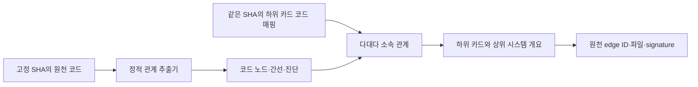

# 정적 관계 스냅샷과 시스템 개요 접점

**계약 초안이며 최신 검증·통합 상태는 [goal](goal.md)을 따른다.** 아래 요구사항과 현재 구현의 한계를 구분한다. 첫 판정의 제품 필수 결함은 0이었지만 비차단 미충족이 남아 있다. 원천 SHA는 `881957cbb431d4af822d1d935ac117e1ede6c303`이다. 실제 실행 순서·패킷 전송·게임 플레이를 관측한 자료가 아니다.

## 경계와 책임

추출기는 저장소 코드의 심볼·직접 관계·해석 근거를 제공한다. Management는 시스템 카드의 ID·표시명·하위/상위 계층·코드 매핑을 소유한다. 뷰어는 두 자료의 기준 SHA와 상태를 확인하고 시스템 개요에서 원천 코드 관계로 내려가는 표시를 맡는다. 화면이나 카드 분류를 추출기에 내장하지 않는다.

도구는 같은 원천을 다시 읽을 수 있어야 한다. `repository`와 전체 `commitSha`는 분석 입력을 식별하며 도구 구현 HEAD와 다를 수 있다. manifest hash, 실제 입력 hash, 도구 버전·설정, 참조 목록과 compiler diagnostics를 근거로 보존한다. 새 시각의 생성물이라는 이유로 최신 소스 또는 완전한 해석이라고 표시하지 않는다.

다음은 구현할 데이터 접점의 흐름이다. 모든 단계의 실행을 완료했다는 도식이 아니다.



## 스냅샷 정보

| 정보 | 의미·검사 |
|---|---|
| `schemaVersion` | 알려진 버전만 수용한다. 소비자가 모르는 버전은 명시적으로 거부한다. |
| `repository`, `commitSha` | 저장소 식별과 분석 입력의 전체 Git SHA. 현재 저장소 SHA-1의 40자리 hex를 사용한다. 미커밋 입력은 해당 사실과 별도 manifest로 구분한다. |
| `extractor` | 이름·고정 버전·configHash. raw 출력과 정규화 변환의 버전·실행 명령도 추적한다. |
| `analysisScope` | manifestHash, 포함·제외 root, 분석 파일과 평가 대상의 차이. 표본 정밀도는 저장소 전체 정밀도가 아니다. |
| 해석 상태·`diagnostics` | 완전/부분/실패를 구분한다. 진단 출처·심각도·위치, unresolved/ambiguous·미지원 관계를 보존한다. 실패를 빈 정상 결과로 변환하지 않는다. |
| `nodes`, `edges` | 결정적인 ID·정렬·중복 제거 기준을 사용하고 모든 확정 간선의 endpoint 존재를 검사한다. |

node는 `id`, `kind`, 설명적인 표시명, namespace·signature, `layer`, 근거가 있는 `source`를 갖는다. kind는 module/file/type/method/packet, layer는 Client/ClientNet/Shared/Server를 구분할 수 있어야 한다. 파일·타입·메서드·패킷의 source는 repo-relative path와 선택적 line/column을 제공한다. 위치는 해당 SHA에만 유효하며 다른 SHA의 줄번호에 조용히 연결하지 않는다.

같은 이름이어도 namespace·소유 타입·signature가 다르면 다른 심볼이다. 예를 들어 `GameMap.ProcessAttack(int,int,long)`과 `CombatSystem.ProcessAttack(GameMap,int,int,long)`을 구분한다. ID의 안정성은 같은 입력 SHA·해석 설정에서 재현됨을 우선하며 파일 이동·signature 변경 뒤에도 ID가 유지된다고 보장하지 않는다. 카드 ID는 추출기 node ID와 결합하지 않는다.

edge는 `id`, 관계 종류, sourceId/targetId, 증거 위치, resolution 상태를 갖는다. 관계 자체는 source·target·kind로 중복 제거할 수 있으나 여러 원시 출현 위치와 문맥을 잃지 않는다. 해석되지 않은 호출은 원문 위치·이름·후보를 진단으로 유지하며 임의로 확정 endpoint를 고르지 않는다. 확정하지 못한 관계를 표현하는 방식은 raw와 변환 결과에서 명시해야 한다.

`resolution=resolved`는 **추출기가 target을 확정했다는 기록**이며 원천 코드상 참임을 검증한 표지가 아니다. CodeGraph가 ClientNet `PacketSession.OnRecv`를 Server의 동명 `FrameValidator.TryValidateFrameHeader`로 잘못 연결한 사례처럼 확정 상태에도 오인이 있다. 현재 관찰된 불가능 층 방향 간선은 CodeGraph 16개/Roslyn 0개다. 숫자 confidence와 resolved만으로 시스템 연결을 신뢰하지 않으며 도구·출처·부분 해석·알려진 오인을 함께 표시한다. 이 관찰은 전역 정확도 검증을 대신하지 않는다.

| 종류 | 정적 의미 | 잘못 해석하기 쉬운 것 |
|---|---|---|
| `contains` | 모듈·파일·타입·메서드의 포함 관계 | 실행 순서나 데이터 전달 관계가 아니다. |
| `calls` | source 메서드 본문의 invocation이 정적으로 해석한 target 선언 | 간접·전이 호출과 가상의 runtime dispatch 대상을 추가하지 않는다. |
| `implements` | 타입 선언에 직접 명시한 인터페이스 | 메서드 override나 모든 조상 인터페이스를 같은 평가 간선으로 섞지 않는다. |
| `usesType` | 메서드 본문에서 참조·생성한 명명 타입 | using·주석·문자열의 이름과 실제 타입 사용을 구분한다. |

람다 내부 호출은 enclosing named method에 연결하되 deferred 문맥과 코드 위치를 보존한다. `GameSession.SubmitAttack` 안의 람다는 `GameMap.ProcessAttack`을 호출한다. 이것은 큐에 들어간 이후 실행될 코드를 정적으로 가리킨 것이며 SubmitAttack 시점의 즉시 실행 관측이 아니다. 반대로 `PongHandler.Handle`의 `EnqueueApply` invocation은 직접 호출이고 그 인자인 람다의 `Debug.Log`와 구분한다.

packet의 protocol ID/version은 원천 PDL·생성 타입·버전 파일의 근거가 있을 때만 선택 정보로 제공한다. `usesType`이 있다는 이유로 “이 패킷이 이 네트워크 경로를 실제 통과했다”는 간선을 만들지 않는다. packet 중심 탐색은 타입 사용·핸들러·직접 호출을 함께 조회하는 정적 뷰다.

## 카드 코드 매핑

Management와 기존 합의한 하위 카드 필드는 다음과 같다. `namespace`와 `role`은 선택적 설명 정보다.

```text
card.id, card.parentId
card.codeReference = { commitSha, mappings: [{ path, kind, namespace?, role? }] }
```

- `commitSha`는 연결 구현 문서의 `sourceCommit`과 같은 전체 SHA다. `snapshot.commitSha`까지 같을 때만 현재 버전의 membership으로 조인한다. 다르면 불일치를 표시하고 자동 재해석·추측 매핑하지 않는다.
- `path`는 repo root 기준 `/` 상대경로이며 Git tree의 정확한 대소문자를 보존한다. 절대경로·빈 값·`.`/`..` 세그먼트·역슬래시·URL·glob은 거부한다. 저장값은 trailing slash 없이 유지하며 소비 시 OS별 소문자화로 맞추지 않는다.
- `kind=file`은 정확한 파일 경로, `kind=directory`는 동일 경로 또는 `path + /`의 세그먼트 경계로 매칭한다. `Maps`가 `MapsLegacy`를 포함하지 않는다.
- `namespace`는 현재 매칭 필터가 아니다. 파일 매핑을 설명하기 위한 메타데이터이며 새로운 필터로 사용할 때는 양측 계약을 다시 정한다.
- 코드 없는 하위 카드는 `mappings:[]`와 상태·사유를 보존한다. 빈 매핑은 카드 부재나 추출기 실패와 다른 상태다. source locator를 임의 파일 열기나 원격 URL 실행 지시로 사용하지 않는다.

## 전체 시스템 개요

2026-10-02 Management 회신 `msg_21aa0289e58f`로 다대다 membership과 집계 해석을 확인했다. 원문은 로컬 `peer-contracts.json`에 있다. 정본 진입점은 Management checkout의 `05_Management/goals/2026-10-02-system-cards/goal.md`의 Architecture 접점 절이며, 이 절의 현재 내용을 읽어 하위 카드 소유·다대다·SHA 조건을 대조했다.

1. 같은 SHA의 하위 카드 코드 매핑에서 node→card membership을 만든다. 한 node가 여러 하위 카드에 들어갈 수 있으며 임의 primary card를 선택하지 않는다. 어떤 path 매핑으로 연결됐는지 근거도 유지한다.
2. 상위 카드의 관계는 하위 membership을 계층으로 올린 **유도된 집계**다. 상위 카드가 별도의 직접 mapping을 소유하는 스키마는 아직 확정하지 않았다. 추출기가 이 필드를 새로 만들지 않는다.
3. 시스템 간 관계에는 근거가 된 코드 edge ID·종류·membership을 남긴다. 같은 source/target 시스템 쌍과 종류에서 같은 원천 edge를 여러 번 세지 않되, 여러 카드가 그 근거를 공유한다는 정보는 지우지 않는다.
4. 카드 사이에 표시한 집계 화살표를 선택하면 근거 코드 간선, 각 endpoint의 파일·namespace·signature·증거 위치로 내려갈 수 있어야 한다. 코드 node를 선택하면 관련된 모든 하위 카드와 유도된 상위 카드로 돌아갈 수 있다.
5. 무매핑 node, 미구현 카드, SHA 불일치, 부분 해석·미지원 관계를 구분한다. 집계 간선 없음은 실제 시스템 사이에 관계가 없다는 증명이 아니다. 카드 내부 간선과 두 시스템 사이 간선의 표시·밀도·경로 질의 UX는 Management/UI의 후속 범위다.

예를 들어 수기 정답표의 `AttackHandler.Handle → GameSession.SubmitAttack → GameMap.ProcessAttack`을 “공격 입력 처리”와 “맵 전투 판정”이라는 설명적인 예시 범주로 묶을 수 있다. 이는 **계약 설명용 예시 범주이며 실제 Management 카드 ID·완성된 집계 결과가 아니다.** 큐 내부 호출의 deferred 문맥을 시스템 개요에서도 근거에 남긴다. 포함·호출·인터페이스·타입 사용은 각각의 관계로 유지해 소비자가 범례와 필터를 제공할 수 있게 한다.

Management 회신 시점의 7/39/9는 디자인 샘플이며 실제 카드 corpus가 아니다. 그 샘플의 기준 SHA는 `333fe20211260ef230cd7d4ef9555cb4d5999c08`로, 이번 분석 SHA와 다르다. 두 자료를 현재 매핑으로 조인하지 않는다. 실제 카드 자료가 같은 SHA로 확정된 뒤 소비자에서 검증해야 한다. 이번 목표는 운영툴 4번 메뉴의 데이터를 준비하며 화면 구현은 포함하지 않는다.

## 평가·검증·현재 한계

닫힌 범위의 평가 자료는 `evaluation-scope.json`·`truth.json`이다. 확정 출력 간선을 먼저 얻은 뒤 채점하며 정답표를 이용해 추출 누락을 메우거나 동명을 맞추지 않는다. TP/FP/FN은 source층·관계 종류별 분모와 함께 보고한다. 미지원 종류의 정답은 FN, 분모 0은 N/A, 분석 미실행은 점수 산출 불가로 구분한다. 범위 밖의 실제 관계는 FP로 세지 않는다.

Unity 입력은 로컬 managed DLL까지이며 InputSystem/TMP의 Library 산출물을 읽지 않는다. 누락 참조로 인한 compiler error와 unresolved 관계는 부분 해석으로 표시한다. 임의 Unity stub을 추가해 완전한 semantic 분석으로 보이게 하지 않는다. 추출기 비교는 Editor 컴파일·플레이·서버 실행·DB 검증을 대신하지 않는다.

독립 Opus는 보고·raw·실제 diff를 대조한 뒤 schema/SHA/path/endpoint·동명 오인·누락 입력·결정적 정규화·원본 보존 등 계약 실패 경로를 검사했다. 46개 테스트 중 정상 성공 43개·expected failure 3개였고 첫 전체 판정은 보고 결함으로 FAIL이다. 최종 형식 승인이나 모든 계약의 충족을 뜻하지 않는다. 제품 비차단 N1–N11·가독성과 과거 판정은 [로컬 검증 이력](../../../.backups/verification/2026-10-02-architecture-extractor-comparison/report-reduction/history.md)에 연결한다.

### 현재 구현 접점과 독립 확인의 한계

`99_Tools/Architecture/Pipeline/snapshot.py`가 공통 검사와 단일 codeReference의 조인을, `normalization.py`가 각 도구 raw 변환을, `cli.py`가 `normalize`·`validate`·`score`·`join` 명령을 제공한다. `schemaVersion=1`, `extractor={name,version,configHash}`, `analysisScope={manifestHash,includedRoots,excludedRoots,inputFileCount}`이며 status 값은 `complete`·`partial`·`failed`·`notRun`이다. 노드와 간선의 `resolution`은 `resolved`·`external`·`unresolved`·`ambiguous`·`unsupported`를 구분한다.

간선은 `evidence` 배열에 여러 출현 위치와 `context`를 담고 `provenance`에 원시 해석 출처를 보존한다. 문맥 값은 `direct`·`declaration`·`deferredLambda`·`unknown`이다. Roslyn은 compiler documentation ID를 추가하며 CodeGraph는 raw signature가 없을 때 `signatureStatus=unavailable`을 남긴다. 표시용 qualified name이 완전한 메서드 signature라는 뜻은 아니다. 외부 심볼은 원본 저장소 파일을 지어내지 않고 `source=null`과 외부 해석 상태로 구분한다.

층별 `complete`는 현재 compiler error 없는 프로젝트 해석을, snapshot의 `complete`는 미해석 관계도 없는 상태를 뜻한다(N5). 두 상태를 같은 의미로 집계하지 않는다. 현재 최상위 결과는 모두 partial이다. Roslyn usesType에는 추론된 var 타입과 메서드 이름 후보 분류가 섞이는 한계(N4)가 있으며 CodeGraph는 명시적 생성 관계 중심의 부분 지원이다. 관계 개수나 상태만으로 전체 타입 사용 지원을 주장하지 않는다.

snapshot schemaVersion 거부는 검사하지만 manifest/scope/truth의 알 수 없는 버전 거부, 정답표 중복·ID·counts 검사, CodeGraph complete raw의 입력 누락 보정은 미충족이다(N1–N3). 동결 manifest 작업본의 CRLF hash와 Git LF blob hash가 달라 새 checkout의 바이트를 자동 호환하지 못한다(N6). 이 요구사항을 모두 구현·통과했다고 표시하지 않는다.

현재 `join_code_reference`는 매핑별 node membership과 SHA 불일치·무매핑 상태를 반환한다. 합성 계약 검사는 수행했지만 실제 카드 corpus 조인은 수행하지 않았다. 여러 카드의 계층 집계와 화면은 위의 소비 계약이며 이번 코드가 완성한 기능으로 표시하지 않는다. 양쪽 packet kind node는 0개이고 protocol ID/version도 없다. packet 선언은 일반 type으로 다룬다. module은 입력 root 5개이며 file/type/method 포함 관계는 다중 부모가 가능하고 중간 폴더·namespace의 별도 모듈 트리는 없다. [비교 보고](comparison-report.md)의 7개 뷰어 기능 데이터 평가가 현재 지원 범위의 근거다.
