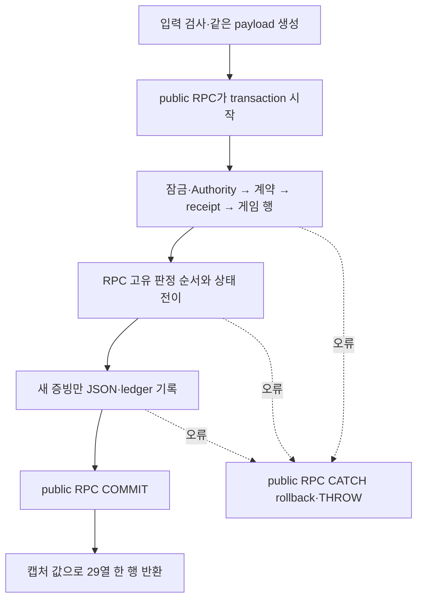

# SQL 공통 구조와 배포 위치 제안

상태: **추천안 승인, 구현 전 설계**. 2026-10-02 GameDev Astra 작성. [goal](goal.md)의 메인 `msg_95aaf70df9ed` 요청에 대한 A/B 비교를 제출했고, `msg_b89cdee4009d`가 명명 OUTPUT·위치(b)·SchemaVersion14→4와 배포 metadata 값 변경의 사용자 승인을 전달했다. 제출본 SHA256 `085081D4193FC5EC044BF347B20BD83B1F758712BCE8FCDC5170C1CE6AF0F6B8`은 로컬 `sql-structure-design-submitted.md`에 보존했다. 아래 비교는 제품 구현·독립 판정·SQL 실행 결과가 아니다. 정리 Sol은 원문 정산·세션 종료했고 F를 먼저 진행한다. 구조 Task 발행 전 정확한 구현 기준 SHA를 고정하며 장치별 실패 대응표는 goal의 마지막 절에 둔다. 쓰기 전 맥락은 `.backups/verification/2026-10-02-persistence-repository/sql-structure-context.md`에 보존했다.

추천은 **명명 OUTPUT 인자로 helper를 연결하고, 위치는 (b) 현재 코드 파일과 버전 이력을 분리하는 안**이다. 다만 단순히 파일 checksum이 달라졌다는 이유만으로 배포하지 않는다. 버전 migration에 승인된 코드 묶음의 hash를 선언하고 그 선언과 일치한 코드만 반복 적용한다. 코드의 현재 위치는 고정하면서 배포 이력·클라이언트의 호환 확인을 유지하기 위한 추가 비용이다. (a)는 실행기를 적게 바꾸는 선택이며 아래 표에 그 대가를 함께 적었다.

## A. helper의 책임과 호출 흐름

입력 수락과 각 operation의 판정·상태 전이는 public RPC가 소유한다. 여러 operation을 `Kind`로 실행하는 거대한 공통 executor는 만들지 않는다. 아래는 책임 경계이며 정확한 SQL 인자는 구현 전 Task에서 고정한다.

| 내부 helper 후보 | 입력 → 출력 | 부작용·불변 조건 |
|---|---|---|
| `LockAndReadAuthority` | 제한된 lock timeout → 바인딩, owner, fence, sequence와 잠금 결과 | 동일 slot1/public/Exclusive/Transaction applock과 Authority 잠금 조회. 별도 transaction·다른 lock 이름 없음 |
| 기존 `AssertPersistenceContract` | 해당 배포 계약 → 설치 schema version | Authority 존재 확인 뒤, receipt 조회 전에 호출. 별도 결과집합·공개 grant 없음 |
| `ReadOperationReceipt` | OperationId, Kind, payload bytes → 증빙 유무, 동일성, 당시 outcome/code/snapshot/시각 | 동일 잠금 조회와 길이+byte 비교. 불일치 요청의 증빙을 반환값으로 노출하지 않음. 현재 상태로 과거 snapshot을 재생성하지 않음 |
| `ReadCharacterState` | 확정된 AccountId/CharacterId → 존재 여부, 소유·class, rowversion, 저장 progress | 잠금 순서 Account→Character→Progress 유지. 존재하지 않는 상태의 null/false 구분과 재호출 때 출력 초기화를 명시. 생성·수선·판정 없음 |
| `RecordOperationReceipt` | 이미 정해진 outcome/code와 캡처 값 → 당시 snapshot·RecordedUtc | 정해진 kind별 JSON shape를 만들고 단 한 번 ledger INSERT. 새 요청만 호출하며 replay·mismatch에는 호출하지 않음. 게임/권위 변경 여부를 helper가 결정하지 않음 |
| `EmitPersistenceResult` | transaction 안에서 확정한 증빙·현재 값·배포 metadata → 단일29열/한 행 | **COMMIT 이후의 순수 최종 projection**. 추가 DB 조회/쓰기·JSON 재해석·새 결과집합 없음 |

DB를 읽거나 쓰는 helper는 호출자의 transaction 안에서 동작한다. helper는 BEGIN/COMMIT/ROLLBACK을 소유하지 않고, 예상 실패는 기존 RPC의 번호·우선순위로 종결한다. public RPC의 CATCH가 rollback·THROW를 마무리한다. 잠금 실패·XACT_ABORT·중첩 호출에서 추가 오류가 생기는지는 실제 SQL 검증에 포함한다. SQL Server의 내부 transaction은 독립된 commit 단위가 아니므로 transaction을 helper마다 열지 않는다. [Microsoft COMMIT 계약](https://learn.microsoft.com/en-us/sql/t-sql/language-elements/commit-transaction-transact-sql?view=sql-server-ver17)

`EmitPersistenceResult`는 “모든 helper가 transaction 안에서 실행된다”는 일반 문장의 유일한 예외다. 결과를 commit 전에 내보내면 기존 수신 계약이 달라진다. 이 helper는 DB 상태를 다시 읽지 않고 이미 캡처한 값만 투영한다. 현재상태와 과거증빙은 서로 다른 인자 이름으로 유지한다.

이 그림은 공통 개념 흐름이다. ReadAdmission은 ledger/게임 조회를 하지 않고, resolver는 absent seal 여부만 판정하며, release는 게임 데이터를 수정하지 않는다. helper를 늘어놓기 위해 원래 없던 조회·쓰기를 추가하지 않는다. acquire의 INSERT 뒤 실제 rowversion 재조회도 필요한 관측이며 제거하지 않는다. 공통 조회 helper를 같은 transaction에서 다시 호출할 때 기존 관측 시점·잠금 순서가 유지되는지 대조한다.

### 상태 전달 비교

| 방식 | 읽기·검증상 이점 | 비용·판정 |
|---|---|---|
| **명명 scalar OUTPUT** | 실제 입출력·타입·부작용이 호출에 드러남. 새로운 DB type/임시 공유 상태가 없음 | 인자가 길어지므로 Authority/Receipt/Game/Result 책임별 helper와 줄바꿈을 유지. 입력·판정·상태전이 구간을 한 번에 읽게 분리한다. **추천** |
| 사용자 정의 table type/TVP | 여러 필드를 한 이름으로 전달 | TVP는 input READONLY이고 OUTPUT을 지원하지 않아 변경 상태 반환용 객체처럼 쓸 수 없음. 별도 반환/copy와 type·권한 계약이 필요해 이번 추출에는 부적합 |
| 호출자 소유 단일행 `#temp` | helper가 공통 행을 갱신해 인자 수를 줄일 수 있음 | 호출명만으로 바뀌는 필드가 드러나지 않음. 각 RPC의 temp schema·초기화·예외 수명·이름 충돌을 검증해야 함. callee가 만든 #temp는 종료 뒤 caller에 남지 않아 초기화 helper 하나로 소유를 감출 수도 없음. 현재는 채택하지 않음 |

TVP 제한과 type 생성/호출 권한은 [Microsoft TVP](https://learn.microsoft.com/en-us/sql/relational-databases/tables/use-table-valued-parameters-database-engine?view=sql-server-ver15), OUTPUT 미지원은 [ADO.NET TVP 설명](https://learn.microsoft.com/en-us/sql/connect/ado-net/sql/table-valued-parameters?view=sql-server-ver17), temp 수명·중첩 이름 규칙은 [CREATE TABLE의 Temporary tables](https://learn.microsoft.com/nb-no/sql/t-sql/statements/create-table-transact-sql?view=sql-server-ver16)를 근거로 삼았다. 표의 유지보수 판단은 이 제약과 현재 단일행 계약에 대한 설계 판단이며 성능 측정 결과가 아니다.

## B. 위치와 배포 방식의 두 안

| 항목 | (a) 버전 migration에 procedure 유지 | (b) 현재 코드와 버전 이력 분리 — 추천 |
|---|---|---|
| 현재 코드를 찾는 곳 | `migrations/NNN_name.sql`. 추후 ALTER가 쌓이면 객체의 마지막 적용 파일을 찾아야 함 | `modules/functions/`, `modules/procedures/`, `modules/procedures/internal/`의 목적 이름 파일. 현재 본문은 한 곳 |
| 변경 | 처음 적용 전 재번호화, 적용 뒤 새 ALTER migration 추가. 과거 파일 불변 | 현재 파일을 CREATE OR ALTER로 변경. **새 버전의 배포 선언이 해당 manifest hash를 승인해야 재적용** |
| 실행기 | 현재 번호·checksum 검사/한 파일 한 batch/전체 transaction을 유지하고 helper 의존 순서만 확장 | 구조/배포 선언 migration → 승인된 manifest·파일 hash 대조 → 함수/내부 helper/public RPC → 9grant 재적용 → 엄격 catalog → COMMIT |
| 저장 기록 | 기존 SchemaVersion과 현재 verify-schema module hash | 기존 SchemaVersion + 코드 묶음 선언 이력 + 적용한 객체별 source/definition hash 기록 |
| 장점 | 새 설치 체계가 작고 실패 경계를 이미 파악함 | 같은 operation 수정마다 예전 본문을 새 migration에 복사하지 않음. 운영 코드 위치와 migration 이력의 책임이 분명함 |
| 비용 | 역사 속 여러 정의와 최신 catalog를 함께 관리. 후속 ALTER마다 본문 복사·탐색 비용 | 추가 배포 metadata·manifest·runner 단계와 독립 회귀가 필요. 단순한 파일 이동보다 큰 변경 |
| 되돌리기 | 새 보정 ALTER migration으로 전진. 과거 checksum 수정/DB restore로 되돌리지 않음 | 이전 로직을 현재 schema에 맞춘 **새 선언·코드 묶음**으로 배포. 과거 버전 checkout을 그대로 실행하거나 hash만 낮춰 덮어쓰지 않음 |

폴더 근거는 기존 `99_Tools/database/`가 DB 설치·검증·수명 관리를 소유하고, `migrations/`가 적용 이력을, `test-environment/`가 환경 수명을 구분하는 구조다. (b)의 `modules`는 SQL 함수·procedure의 현재 정의만 모은다. 공개 RPC와 내부 helper를 나누고 파일명은 `acquire_and_load.sql`, `lock_and_read_authority.sql`처럼 목적을 쓴다. `modules/manifest.json`에는 정확 파일·SQL 객체명/종류·의존 순서·source/definition hash를 명시한다. 광범위 디렉터리 검색으로 예상 밖 SQL을 자동 실행하지 않는다. 권한 파일은 `modules/permissions.sql`이며 9개의 승인 grant만 반복 적용한다.

### (b)의 metadata와 실행기 경계

001은 byte/checksum 모두 보존한다. 아직 미적용인002 이후만 사용자 선택 후 재배치한다. 구체 번호 제안은002 기존 authority/operation/role,003 코드 배포 metadata,004 최초 코드 묶음 선언이다. 함수·procedure·grant는 반복 적용 경로로 옮긴다. 이 안을 선택하면 현재 초안의 **SchemaVersion14는4로 다시 고정**하고 전체 expected migration 집합·checksum·catalog·계획/B 소비 문서를 함께 갱신한다. “새 helper를 넣었으니14를 계속 반환” 같은 허위 metadata는 만들지 않는다.

추가 metadata는 두 책임이다. `dh.ModuleRelease`는 해당 버전 migration이 선언한 manifest hash를 보존하고, `dh.ModuleDefinition`은 정확한 객체별 적용 source/engine-definition hash를 기록한다. 런타임/복구 역할에는 이 테이블이나 helper의 직접 권한을 주지 않는다. 첫 설치 외에는 기존 객체의 실제 정의와 이전 적용 기록이 일치해야 하며 수동 변조·미등록 객체·기록 누락은 자동 채택/덮어쓰기 대신 거부한다.

`MigrationManifest`는 기존 `{version,name,checksum}` 배열 형식과 정렬을 유지한다. 새 버전 선언 SQL의 checksum이 코드 manifest hash를 포함해 그 코드 묶음을 식별한다. 따라서 B1은 기존 방식대로 기대 migration 배열을 대조하면서 승인된 코드 묶음까지 연결할 수 있다. procedure만 바꾸고 선언 version을 올리지 않는 변경은 거부한다. 선언과 module 적용·hash 기록·catalog 확인은 같은 transaction에서 commit되므로 절반 적용을 완료로 기록하지 않는다.

manifest는 runtime module과 권한 파일의 명시 목록을 hash하며 자기 자신과 그 hash를 담은 버전 선언 SQL은 목록에 넣지 않는다. 순환 hash를 만들지 않는다. source checksum은 기존 migration의 개행 정규화 원칙과 맞추고 manifest 자체의 UTF-8/BOM·개행 규약을 별도로 고정한다. engine-definition의 기대 hash는 검토된 소스에서 만들어 manifest에 고정하며, 실행 후 DB에서 읽은 hash를 그대로 정답으로 등록해 자기 대조하지 않는다. `verify-schema.sql`과 실행기 자체의 버전·파일 hash는 G2의 실행 코드 근거로 별도 고정한다.

공개9RPC의 signature·결과29열 이름/SQL type/순서·TransportVersion/PayloadVersion/SnapshotVersion·payload bytes·결과/오류코드·9grant·검사 우선순위는 유지한다. **SchemaVersion과 MigrationManifest의 배포 값은 바뀐다.** (a)도 helper migration 추가로 이 값이 바뀌므로 외부 동등성 표에서 배포 metadata를 승인된 차이로 분리해야 한다. 이 값을 포함해 모든 응답 byte가 같다는 표현은 사용하지 않는다. 아직 B1 소비 코드와 실제002+ 배포가 없으므로 위치 선택과 함께 정확한 새 기준을 고정할 시점이다.

CREATE OR ALTER는 파일 하나/SQL batch 하나로 처리한다. runner에 GO 분할이나 runtime 동적 SQL을 넣지 않는다. ALTER가 기존 permission을 유지해도 9grant의 멱등 재적용과 실제 전체 권한 집합 검사를 생략하지 않는다. [Microsoft CREATE PROCEDURE](https://learn.microsoft.com/en-us/sql/t-sql/statements/create-procedure-transact-sql?view=sql-server-ver17), [ALTER PROCEDURE 권한 보존](https://learn.microsoft.com/en-us/sql/t-sql/statements/alter-procedure-transact-sql?view=sql-server-ver17)

실제 엔진이 보존하는 CREATE OR ALTER의 module text, 이미 알려진 CHECK3개 parent_column_id, scalar named EXEC/ownership chain은 아직 관측하지 않았다. 현재 source checksum과 engine definition hash를 혼동하지 않고 최초 실제 실행에서 원문을 관측한다. 예상과 다르면 허용 패턴을 늘려 통과시키지 않고 새 수정·검증을 거친다.

## 게이트와 독립 검증

| 게이트 | 이번 결정의 반영 |
|---|---|
| G0 | helper 구현은 승인됨. 위치(a)/(b), 선택된 migration 번호·배포 metadata와 consumer 기준을 사용자 선택 후 goal/기술명세에 고정 |
| G1 | 정확한 시험 DB·계정·한 번 수명·TLS·비밀/cleanup 권한은 그대로. 별도 DB/새 라이브러리/전역 설정 권한을 만들지 않음 |
| G2 | 최종 provision/install/cleanup/**recovery launcher**의 실제 diff·실행 주체·입력 hash를 신규 Opus가 최초 실제 실행 전에 검토. 현재 B1/B2가 미구현이므로 SQL 정리만으로 G2 완료라고 하지 않음 |
| G3 | 정리+뼈대 분리를 하나의 신규 Opus SQL 검증으로 묶음. 정적/독립 오프라인 시험과 G2 후 실제 SQL 결과를 구분. 실제 SQL은 S/C/O/U/R 기존 계획에 배포 회귀를 추가 |
| G4 | operation/owner/연결/자원 정산 및 exact cleanup. 코드 변경을 되돌린다는 이유로 DB/fence/ledger를 과거로 돌리지 않음. 최종 원문/차이·미실행과 PR별 사용자 병합 승인 |

독립 검증의 차단 항목은 다음과 같다.

- 9RPC signature/29열 타입·순서와 모든 code/error/grant, payload·fresh/replay snapshot을 요구사항과 실제 소스·실행 결과에서 대조한다. 비교기가 같은 오해를 반복하지 않도록 선언과 실제 reader metadata/golden vector를 독립 확인한다. 최근 datetime2(3) 추출 오류를 재발 사례로 넣는다.
- bound→schema→receipt→game의 우선순위와 operation별 최초 실패, replay/mismatch/seal에서 금지된 쓰기, post-commit 단일 결과, stale/unknown·cancel/rollback/lock 실패를 기존 D1a 계획과 대조한다. helper의 불필요한 조회·중간 result set·직접 grant가 있으면 결함이다.
- (b)는 동일 묶음 재실행, manifest/선언/파일/engine hash 불일치, 미등록·누락 모듈, 중간 module 실패 rollback, 권한 재적용/예상 밖 grant, 새 version의 변경 모듈만 재적용, 이전 설치/게임 행 보존을 독립 시험한다. 승인된 단일 DB 수명 안에서 단계별 원문을 보존한다.
- 코드 규칙 원문을 구현·검증 Task에 붙이고 적용 규칙/실제 파일:줄 및 변환 뒤 직접 읽은 블록을 남긴다. 이름 있는 코드값, 중첩 소속, 이유 주석, 공통 책임·파일 위치 위반은 번호 있는 차단 결함이다. 기존 범위 밖 코드와 미실행은 분리한다.

정리 Sol 정산 후 서식 등록 F의 Sol→신규 Opus→PR 우선순위를 유지한다. 이 설계안의 위치 선택은 메인이 사용자에게 확인하며, 확인 전 구조 구현 Task는 발행하지 않는다. 선택 이후 정리 최종 SHA·정정된 근거를 입력으로 사용하고, SQL 합동 검증과 B1/B2·G2의 실행 순서를 goal에 갱신한다.
