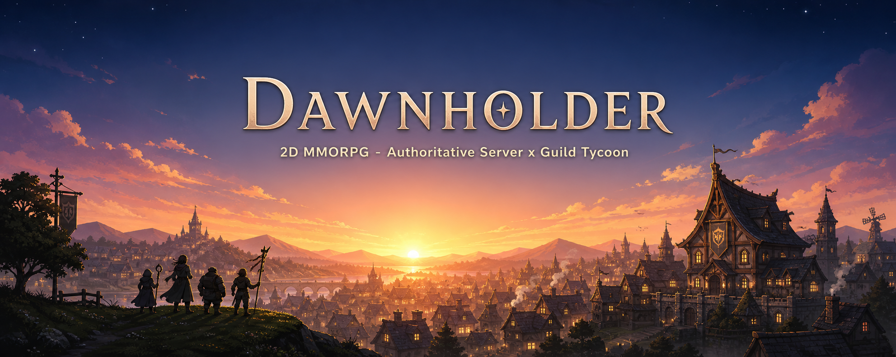

# Dawnholder



> 2D MMORPG — .NET 10 **권위 서버** × Unity 6 클라이언트 × 길드 타이쿤.
> 그리고 그것을 만들어낸 **AI 운영 하네스**. KNUT 캡스톤 졸업작품 (4인 팀, 팀장 유영호).

---

## 이게 뭐예요?

**Dawnholder**는 .NET 10 + Unity 6 LTS 기반 2D MMORPG 프로토타입입니다. RPG와 길드 타이쿤 장르 결합. 권위 서버 + 클라이언트 예측·재조정 + 로컬 멀티플레이 데모가 목표.

그런데 본 레포의 **진짜 자산**은 게임 코드가 아니라 **AI 운영 시스템**입니다. Claude Code를 어떻게 통제하고 견제하는지의 설계 — 헌법, 서브에이전트, 슬래시 커맨드, 자동 검증 훅, 작업 봉투, 박제 시스템.

핵심 가치 (포트폴리오):

> AI에게 코드를 시키는 것과, AI를 운영하는 것은 다르다.
> 본 레포는 *AI를 어떻게 운영하고 통제하고 견제했는가*를 코드와 문서로 박제한다.

### 30초 하이라이트 (외부 열람자용)

- **권위 서버**: 서버가 게임 상태의 유일한 진실 공급원 — 이동·전투 판정은 전부 서버, 클라이언트는 입력과 표현
- **클라이언트 예측·재조정**: 로컬 플레이어는 prediction 경로, 원격 엔티티는 보간 경로로 분리 구현
- **전체 루프 직접 구축**: 클라 ↔ 서버 ↔ MSSQL ↔ 공유 프로토콜(PacketGenerator) ↔ CI/CD 게이트 ↔ 자동 검증 훅
- **AI 운영 5계층**: 헌법(L1) + 서브에이전트 8(L2) + 슬래시 커맨드 13(L3) + 검증 훅 9(L4) + 지식 캐시 5(L5) — 아래 표
- **실행 데모**: self-contained GameServer + Unity 클라이언트 시연 빌드 (2026-06 캡스톤 1차 발표 완료)

### 게임 미리보기


*인게임 패럴랙스 배경 「CastleValley Sunset」 — 7레이어 분해 소스가 레포에 그대로 있다 (`03_Client/Assets/Art/Environment/BackGround/Parallax/`).*

| 플레이어블 — Knight | 플레이어블 — Mage |
|---|---|
|  |  |

*캐릭터 idle 스프라이트 시트 일부. 아트는 김인규가 ComfyUI 기반 AI 파이프라인으로 제작 — 원본 시트·스킬 이펙트·NPC·보스가 `03_Client/Assets/Art/`에 그대로 있다.*

---

## 빠른 셋업 — 팀원용

> 먼저 [팀원 사용 가이드](00_Document/team-guide.html)를 브라우저로 열어보세요. 이 README보다 친절하고 그림이 있습니다. README는 요약판이에요.

**4단계로 진입**. 학부생 백지여도 OK. 막히면 그 자리에서 Claude가 안내해줍니다.

### 1. 사전 설치 (본인이 직접)

다음 4가지를 본인 컴퓨터에 설치해야 합니다:

| 항목 | 다운로드 |
|---|---|
| Git for Windows | https://git-scm.com/download/win |
| .NET 10 SDK | https://dotnet.microsoft.com/download/dotnet/10.0 |
| MSSQL LocalDB (Express 또는 Developer 에디션, "LocalDB" 옵션 체크) | https://www.microsoft.com/sql-server/sql-server-downloads |
| VS Code | https://code.visualstudio.com/ |
| Claude Code (VS Code 확장) | VS Code 확장 패널에서 `claude-code` 검색 |

⚠️ **백엔드 역할(유영호 외)이면**: Visual Studio 또는 Rider도 본인 선택 가능. 다만 본 셋업은 VS Code 기준.

⚠️ **Unity 클라 역할(김인규, 정유현)이면**: Unity Hub + Unity 6 LTS (`6000.4.7f1` 정확한 빌드)도 필요. 셋업 가이드에서 안내함.

### 2. 레포 clone

ASCII 경로(한글 없는 경로)에 clone하세요. 본인 헌법 ADR-017 — 한글 경로면 자동 검증 훅이 silent fail합니다 (팀장이 48시간 함정 겪음).

```bash
cd /c/Dev    # 권장 위치
git clone <레포 URL> ClaudeDev
cd ClaudeDev
```

### 3. VS Code에서 Claude Code 실행

```bash
code .
```

VS Code 열리면 우측 하단에 "권장 확장 설치할래?" 팝업 떠야 합니다. **Install All** 누르면 협업 최소 셋(C# Dev Kit, GitLens, Claude Code 등) 자동 설치.

설치 후 VS Code의 Claude Code 패널을 엽니다.

### 4. `/setup` 호출

Claude Code 채팅창에:

```
/setup
```

이게 끝입니다. 이후는 Claude가 차근차근 안내해요:
- 자기소개 (한글 이름) → 영문 식별자 + 역할 자동 결정
- 환경 검증 8단계 (Git Bash, .NET, MSSQL, VS Code 통합 터미널 등)
- 역할별 셋업 (백엔드 또는 Unity 클라)
- 본인 작업 공간 초기화 (작업 좌표 핀 — `.claude/state/current-pin.txt`)
- 본인 노션 페이지 안내 + 첫 작업 안내

막히는 거 있으면 그 자리에서 Claude한테 물어보세요. 학부생 백지 가정으로 떠먹입니다.

---

## 매일 작업 흐름

```
세션 시작:   /session:start         (work-pin 좌표 인지 + 최근 변경 확인)
작업:        Phase 진행, 막히면 Claude한테 자연어로 질문
Phase 끝:    -DONE.md 박제 후
             /session:end          (commit + PR + 노션 박제 + 다음 액션)
```

전체 슬래시 커맨드 13개 카탈로그: [`00_Document/commands-index.md`](00_Document/commands-index.md). 옛 학습 5 + 일지 3 슬래시는 M3.5에서 제거됨 (ADR-022) — 학습 추적 트랙 B 자체도 ADR-025로 은퇴 (회고는 대화/노션 자유 양식).

---

## 협업 룰 (한 줄씩)

- **main 브랜치 직접 push 금지** — 팀원은 PR로만 머지 (팀장은 bypass 권한)
- **본인 영역만 만지기** — [`.github/CODEOWNERS`](.github/CODEOWNERS) 참조. 백엔드는 팀장 단독, 클라는 인규/유현 공유, 학습 일지는 각자
- **하네스 변경 인지** — 팀장이 헌법/ADR/하네스 갱신하면 [`.claude/CHANGELOG.md`](.claude/CHANGELOG.md)에 박힘. `/session:start`가 매일 자동 확인
- **개인 자산은 git 무시** — `current-pin.txt`(작업 좌표)는 각자 보유 (세션 간 단일 핸드오프, ADR-025)

---

## AI 운영 시스템 — 5 계층

본 레포의 핵심 자산. 자세한 구조는 헌법([`CLAUDE.md`](CLAUDE.md)) 참조.

| 계층 | 자산 | 역할 |
|---|---|---|
| L1 — 규칙 | [`CLAUDE.md`](CLAUDE.md) + [`00_Document/policies/`](00_Document/policies/INDEX.md) | 헌법(v1, ADR-022)은 절대 원칙·라우팅·스택·등급·SubAgent 풀·Knowledge 시스템만 유지. 운영 정책 11개(보고 양식 / 핀·박제 / 문서 임계 / 리뷰 Tier·스루풋 / 등급·위험 / 라우팅 / Knowledge / 루프 드라이버 / PR·머지 게이트 / work-judge)는 `policies/`로 외부화 |
| L2 — 역할 | [`.claude/agents/`](.claude/agents/) | 서브에이전트 8개 = Worker 4 (server / shared / client / qa) + Reviewer 2 (reviewer—Tier 2 자동 / plan-auditor—Phase 정의 사전 검증) + Specialist 2 (coordinator / knowledge-gc). unity-bridge는 M7.5에서 폐기 — Unity asset/MCP는 메인 세션이 직접 |
| L3 — 단축키 | [`.claude/commands/`](.claude/commands/) | 슬래시 커맨드 13개 (작업 4 / 세션 4 / 점검 3 / 엔진 1 / 셋업 1). 옛 학습 5 + 일지 3 슬래시는 M3.5에서 제거 (ADR-022), 학습 트랙 B는 ADR-025로 은퇴 |
| L4 — 검증 | [`.claude/hooks/`](.claude/hooks/) | 자동 검증 훅 9개 (dangerous-cmd-guard / tdd-guard / circuit-breaker / risk-detector / shared-discipline-guard / pin-injector / phase-gate-validator / convention-size-guard / reviewer-auto-trigger) |
| L5 — 캐시 | [`.claude/knowledge/`](.claude/knowledge/) | SubAgent 도메인별 학습 캐시 5 (cross-cutting / server / shared / client / qa) + GC (knowledge-gc agent) — 신설 (ADR-022) |

추가 인프라:
- [`00_Document/PRD.md`](00_Document/PRD.md) — 무엇을 만드는지
- [`00_Document/ARCHITECTURE.md`](00_Document/ARCHITECTURE.md) — 어떻게 만드는지
- [`00_Document/ADR/`](00_Document/ADR/) — 결정 박제 (`INDEX.md`에 전체 목록)
- [`00_Document/policies/`](00_Document/policies/INDEX.md) — 헌법 외부화 정책 11파일 (`INDEX.md`에 전체 목록). 자기참조 정책 루프 해소 — "절대 어기지 않는 것"(헌법) vs "그것을 어떻게 운영하는가"(정책) 분리
- [`00_Document/REVIEW_CHECKLIST.md`](00_Document/REVIEW_CHECKLIST.md) — reviewer 에이전트 5축 점검 기준 (ADR-019 + ADR-022 정합)
- [`01_Phases/`](01_Phases/) — Phase 단위 작업 박제, **팀원별 폴더**(`youngho`/`inkyu`/`yuhyeon`)에 정의 + `-DONE` 결과 페어 (2026-07 재편, M7.x 진행 중)

---

## 폴더 구조

```
00_Document/        결정·구조 문서 (PRD, ARCHITECTURE, ADR, policies, REVIEW_CHECKLIST, 학습 일지)
01_Phases/          작업 단위 (팀원별 폴더, Phase 정의·DONE 페어)
02_Server/          권위 서버 (.NET 10) — 팀장 단독
03_Client/          Unity 클라 (6000.4.7f1) — 인규/유현 공유
04_ClientNet/       클라용 socket 라이브러리 (Y2 모델) — 팀장 단독
98_Shared/          서버·클라 공유 프로토콜 (.NET Standard 2.1 DLL) — 팀장 단독
99_Tools/           PacketGenerator 등 도구 — 팀장 단독
.claude/            AI 하네스 (agents 8 / commands 13 / hooks 9 / knowledge 5도메인 / templates / setup-steps) — 하네스 v1 (ADR-022) + M7.x 정비
.github/            CODEOWNERS + GitHub 설정
.vscode/            VS Code 협업 최소 셋 (Git Bash 통합 터미널, 자동 저장 등)
```

---

## 팀 구조

| 역할 | 이름 | 영역 |
|---|---|---|
| 팀장 | 유영호 (@bass131) | 백엔드 코어 + 하네스 + 문서 |
| 팀원 1 | 김인규 | Unity 클라 아트 리소스 + 컨텐츠 (ComfyUI 활용) |
| 팀원 2 | 정유현 | Unity 클라 UI/입력 + 컨텐츠 |
| 팀원 3 | 박정우 | MES 관제 시스템 (별도 레포 — ADR-011) |

---

## 일정

- ✅ **6월** — 캡스톤 1차 발표 완료 (self-contained GameServer + Unity 클라 시연)
- **11월 19일** — 졸업작품 본 마감 (현재 M7.x 진행 중)

---

## 막혔을 때

| 상황 | 어디로 |
|---|---|
| 셋업 막힘 | `/setup` 다시 호출 또는 Claude한테 직접 물어보기 |
| 작업 중 개념 모름 | Claude한테 자연어로 질문 (예: "이 코드 한 줄씩 설명해줘", "이 ADR 왜 박혔어?") |
| Git/PR 막힘 | 팀장(유영호)에게 슬랙 |
| 빌드 에러 | 에러 메시지 그대로 Claude한테 보여주기 |
| 헌법/ADR 결정 이유 궁금 | Claude한테 자연어로 질문 또는 `00_Document/ADR/INDEX.md` 참조 |
| 본인 회고 박고 싶음 | 본인 노션에 자유 양식 (AI 인터뷰 도움 가능). 학습 추적 트랙 B는 ADR-025로 은퇴 (자율 박제) |

---

## 라이선스

졸업작품 포트폴리오 저장소입니다. 코드·문서 **열람은 환영**하지만,
별도 명시가 있기 전까지 재사용 권리는 유보됩니다 (all rights reserved).
