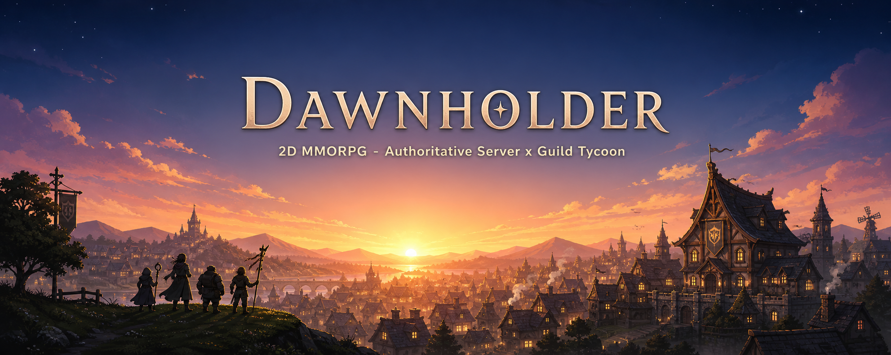
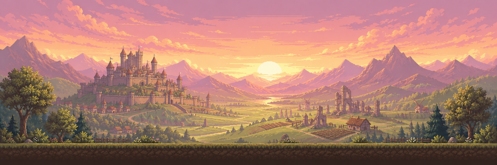
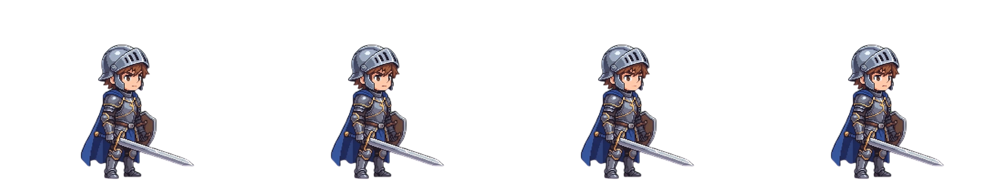
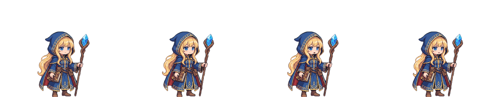

# Dawnholder



> .NET 10 권위 서버와 Unity 6 클라이언트로 구현한 2D MMORPG 프로토타입.
> KNUT 4인 캡스톤 프로젝트에서 서버와 AI 협업 환경을 설계·구현했습니다. (팀장 유영호)
>
> 게임 소개 페이지: <https://bass131.github.io/dawnholder-server/>

---

## 프로젝트 소개

**Dawnholder**는 RPG 전투와 길드 타이쿤 요소를 결합한 2D MMORPG 프로토타입입니다. 서버가 이동과 전투를 판정하고, 클라이언트는 예측·재조정으로 조작 지연을 줄입니다. 로컬 환경에서 멀티플레이 전 과정을 시연할 수 있도록 구성했습니다.

게임 구현과 함께 **AI 협업 환경**도 설계했습니다. 기존 Claude Code 운영 자산은 보관하고, 현재는 Codex 메인 세션이 목표와 결정을 관리하며 작업자 구현과 독립 검증을 조정하는 프로젝트 지침을 운영합니다.

### 핵심 구현

- **권위 서버**: 서버가 게임 상태를 소유하며 이동과 전투를 판정하고, 클라이언트는 입력과 화면 표현을 담당
- **클라이언트 예측·재조정**: 로컬 플레이어의 예측 경로와 원격 엔티티의 보간 경로를 분리
- **클라이언트·서버 연결**: Unity 클라이언트, .NET 서버, PacketGenerator 기반 공유 프로토콜을 연동. MSSQL 영속화는 설계·후속 구현 영역
- **AI 협업 환경**: 메인 세션의 목표·결정 관리, 작업자 구현, 독립 검증, 단일 목표 기록으로 역할을 분리
- **실행 데모**: self-contained GameServer + Unity 클라이언트 시연 빌드 (2026-06 캡스톤 1차 발표 완료)

### 게임 미리보기



*인게임 패럴랙스 배경 「CastleValley Sunset」. 7개 레이어로 분리한 소스는 `03_Client/Assets/Art/Environment/BackGround/Parallax/`에서 확인할 수 있습니다.*

| 플레이어블 — Knight | 플레이어블 — Mage |
|---|---|
|  |  |

*캐릭터 idle 스프라이트 시트 일부. 김인규가 ComfyUI 기반 AI 파이프라인으로 제작했으며, 원본 시트·스킬 이펙트·NPC·보스 리소스는 `03_Client/Assets/Art/`에 있습니다.*

---

## 개발 환경과 현재 작업

[개발 안내](00_Document/operations/DEVELOPMENT.md)에서 SDK·Unity 버전, 빌드와 실행 진입점, 검증 범위를 확인하세요. 현재 목표는 [CURRENT](00_Document/operations/CURRENT.md)가 가리키는 `goal.md`에 정리합니다. [영역별 계약](00_Document/domains/INDEX.md)에서 수정할 기능의 주요 파일과 주의사항을 찾을 수 있습니다.

- 프로젝트 운영 기준: [AGENTS.md](AGENTS.md)
- 다단계 작업 운영: [dawnholder-goal-loop](.agents/skills/dawnholder-goal-loop/SKILL.md)
- 문서·설계 탐색: [문서 지도](00_Document/INDEX.md), [FEATURE_MAP](00_Document/FEATURE_MAP.md), [ADR](00_Document/ADR/INDEX.md)
- 필요할 때의 Orca 다중 세션: [ORCA](00_Document/operations/ORCA.md)

메인 대화 세션은 목표·범위·주요 결정과 종합 보고를 맡고, 실제 구현·테스트는 작업자에게 위임하며 독립 검증자를 분리합니다. 지침과 스킬은 운영 약속이며 모든 행동을 기술적으로 강제하는 장치는 아닙니다.

각 목표는 최신 `main`에서 개별 브랜치를 만들고 구현·독립 검증 후 PR을 작성합니다. **각 PR 병합 직전에는 사용자 명시 승인을 받습니다.** 자동 병합을 예약하지 않습니다.

### 이전 AI 협업 환경

Claude Code 규칙·역할별 에이전트·슬래시 명령·검증 훅·지식 캐시로 구성했던 환경은 [고정 Git 원문](https://github.com/bass131/dawnholder-server/tree/f0f23f781dc49d8bf67c0019b948696c36ed6c00)에서 확인할 수 있습니다. 과거 작업·운영 정책은 [영역별 보관](00_Document/archive/INDEX.md)에서 요약과 고정 Git 원문으로 확인합니다. 역사 자료의 절차를 현행 규칙으로 자동 적용하지 않습니다.

## 폴더 구조

```text
00_Document/        요구사항·아키텍처·ADR·현행 운영 안내·과거 기록
01_Phases/goals/    목표별 기준·상태·결과
02_Server/          .NET 권위 서버
03_Client/          Unity 클라이언트
04_ClientNet/       클라이언트용 소켓 라이브러리
98_Shared/          공유 프로토콜·게임 데이터
99_Tools/           PacketGenerator·헤드리스 봇·실행 도구
.agents/skills/    프로젝트 전용 Codex 스킬
.github/           CODEOWNERS와 저장소 설정
```

---

## 팀 구조

| 역할 | 이름 | 영역 |
|---|---|---|
| 팀장 | 유영호 (@bass131) | 백엔드 코어 + 하네스 + 문서 |
| 팀원 1 | 김인규 | Unity 클라이언트 아트 리소스 + 콘텐츠 (ComfyUI 활용) |
| 팀원 2 | 정유현 | Unity 클라이언트 UI/입력 + 콘텐츠 |
| 팀원 3 | 박정우 | MES 관제 시스템 (별도 레포 — ADR-011) |

---

## 일정

- ✅ **6월** — 캡스톤 1차 발표 완료 (self-contained GameServer + Unity 클라 시연)
- **11월 19일** — 졸업작품 본 마감

---

## 문제 해결

환경·빌드는 [개발 안내](00_Document/operations/DEVELOPMENT.md), 진행 상태·남은 검증은 [현재 목표](00_Document/operations/CURRENT.md), 설계의 배경은 [ADR](00_Document/ADR/INDEX.md)에서 확인합니다. 과거 `/setup`이나 `/session:start`는 현행 Codex 명령이 아닙니다.

---

## 라이선스

이 저장소는 졸업작품 포트폴리오의 열람을 위해 공개했습니다.
별도 라이선스가 명시되지 않은 코드와 문서의 재사용 권한은 부여하지 않습니다 (all rights reserved).
